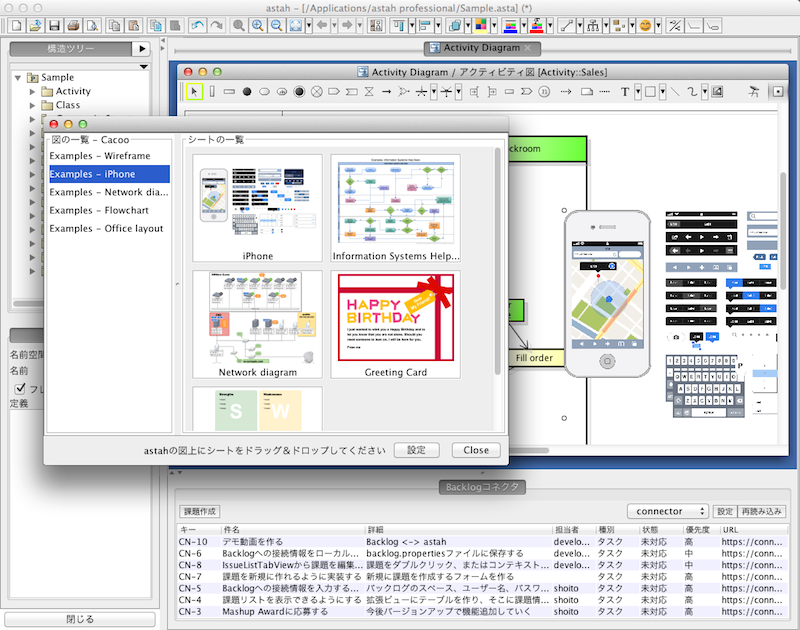

Cacooインポートプラグイン
=================

[Cacoo](http://cacoo.com/)で作成した図をastahの図上にドラッグ＆ドロップで取り込めるastahプラグインです。

astah UML, professionalの何れかにインストールして利用します。

インストール
---
[こちらのページ](https://github.com/shoito/astah-cacoo-plugin/downloads)から **[cacoo2astah-x.x.x.jar](https://github.com/downloads/shoito/astah-cacoo-plugin/cacoo2astah-0.1.0.jar)** ファイルをダウンロードし、`astahのインストールフォルダ/plugins/`にコピーしてastahを再起動します。

### astahバージョン6.6以上のインストール
この辺から各OS用のインストーラーをダウンロードして、実行します。

<http://astah.change-vision.com/ja/product/astah-uml.html>

<http://astah.change-vision.com/ja/product/astah-professional.html>

アンインストール
---
`astahのインストールフォルダ/plugins/` から **cacoo2astah-x.x.x.jar** ファイルを削除してastahを再起動します。

使用方法
---
1. astahを起動して、メニューから[ツール] - [Cacooの図をインポートする]を選択してください。
2. ダイアログ下の設定ボタンを押下し、[CacooのAPIキー](https://cacoo.com/profile/api)を入力してください。(APIキーを変更しない限り1度だけ)
3. Cacoo上の図とそれらのシートが読み込まれるので、astahの図上にシートをドラッグ＆ドロップしてください。画像が挿入されます。

フィードバック
---
感想、要望、不具合などありましたら [@shoito](http://twitter.com/shoito) へツイートいただけると嬉しいです。

License
---
Copyright 2012 shoito.

Licensed under the Apache License, Version 2.0: <http://www.apache.org/licenses/LICENSE-2.0>